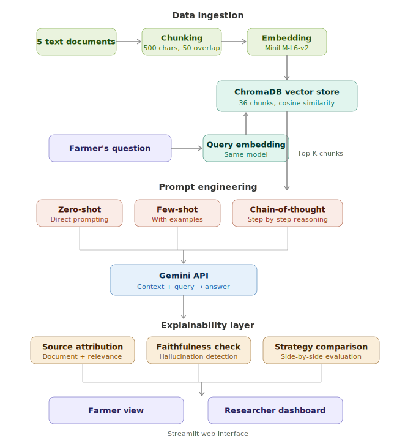

# 🌾 AgriAdvisor - Explainable LLM-based Agricultural Advisory System

**[🚀 Try the Live Demo](https://agriadvisor.streamlit.app/)**

An explainable AI-powered advisory system that helps farmers get trustworthy, source-backed answers to agricultural questions. Built using Retrieval-Augmented Generation (RAG) with transparent source attribution, faithfulness verification, and prompt strategy comparison.

---

## Why This Project?

Agricultural AI advisory systems face a trust problem: farmers need to know **where** advice comes from and **how reliable** it is before acting on it. A black-box LLM that says "apply 150 kg/ha of nitrogen" is useless without showing its sources, and dangerous if it hallucinates.

AgriAdvisor tackles this by making every step of the pipeline transparent, from which documents were retrieved, to how relevant they are, to whether the generated answer is actually faithful to the source material.

---

## Architecture

<p align="center">
  
</p>

The system follows a modular RAG pipeline with an explainability layer:

1. **Ingestion** - Agricultural documents are chunked (500 chars, 50-char overlap) and embedded using HuggingFace's `all-MiniLM-L6-v2` into 384-dimensional vectors, stored in ChromaDB with cosine similarity indexing.

2. **Retrieval** - A farmer's question is embedded with the same model and matched against the vector store. The top-K most relevant chunks are retrieved with similarity scores.

3. **Prompt Engineering** - Retrieved context is injected into one of three configurable prompt strategies:
   - **Zero-shot**: Direct question + context, no examples
   - **Few-shot**: Includes 2 example Q&A pairs to guide response style
   - **Chain-of-thought**: Asks the LLM to reason step-by-step before answering

4. **Generation** - Google Gemini API generates an answer grounded in the retrieved context.

5. **Explainability** - Three transparency mechanisms verify and explain the output:
   - **Source Attribution**: Shows which documents contributed, with confidence levels (HIGH/MEDIUM/LOW)
   - **Faithfulness Check**: A secondary LLM call verifies whether the answer is grounded in the context or hallucinated
   - **Strategy Comparison**: Runs all three prompt strategies side-by-side for researcher analysis

6. **Interface** - Dual Streamlit views: a clean Farmer View for simple Q&A, and a Researcher Dashboard exposing the full explainability pipeline.

---

## Tech Stack

| Component | Technology | Why This Choice |
|-----------|-----------|----------------|
| Embeddings | `all-MiniLM-L6-v2` (HuggingFace) | Fast, lightweight (90MB), 384-dim vectors - ideal for domain-specific retrieval without GPU |
| Vector Store | ChromaDB | Persistent, embedded vector DB with native cosine similarity - no external server needed |
| Text Splitting | LangChain `RecursiveCharacterTextSplitter` | Smart splitting that respects paragraph and sentence boundaries |
| LLM | Google Gemini API | Free tier available, strong instruction-following for agricultural domain |
| UI | Streamlit | Rapid prototyping of data apps with dual-view capability |
| Experiment Tracking | Custom JSON-based logger | Lightweight, resumable evaluation without external dependencies |

---

## Evaluation Results

Evaluated on a benchmark of 20 questions across wheat management, rice cultivation, soil health, pest management, and out-of-domain queries.

| Metric | Score |
|--------|-------|
| Retrieval accuracy (in-domain) | **100%** (18/18) |
| Zero-shot keyword recall | 0.963 |
| Few-shot keyword recall | 0.963 |
| Chain-of-thought keyword recall | **0.980** |
| Faithfulness score | **1.0** |
| Out-of-domain detection | **2/2 correctly refused** |

**Key findings:**
- Chain-of-thought produces the most complete answers (0.980 recall) but at 4x the response length; a relevant trade-off for farmer-facing systems where brevity matters.
- The system correctly refuses to answer out-of-domain questions ("What is the capital of France?") instead of hallucinating, demonstrating trustworthy behavior.
- Faithfulness verification confirms all generated answers are grounded in retrieved context with zero hallucination detected.

See [EXPERIMENTS.md](EXPERIMENTS.md) for the full analysis.

---

## Quick Start

### Prerequisites
- Python 3.10+
- Google Gemini API key ([get one free](https://aistudio.google.com/apikey))

### Installation

```bash
git clone https://github.com/mishankjain5/agriadvisor.git
cd agriadvisor
python -m venv venv
source venv/bin/activate        # Linux/Mac
.\venv\Scripts\Activate          # Windows
pip install -r requirements.txt
```

Create a `.env` file in the project root:
```
GEMINI_API_KEY=your_api_key_here
```

### Usage

**1. Build the knowledge base**
```bash
python -m src.ingestion.ingest
```

**2. Launch the app**
```bash
streamlit run app/streamlit_app.py
```

**3. Run the evaluation benchmark**
```bash
python -m src.evaluation.evaluate
```

---

## Project Structure

```
agriadvisor/
├── app/
│   └── streamlit_app.py           # Dual-view Streamlit interface
├── data/
│   ├── raw/                       # Agricultural knowledge documents
│   └── chromadb/                  # Vector database (auto-generated)
├── src/
│   ├── ingestion/
│   │   └── ingest.py              # Document loading → chunking → embedding → storage
│   ├── retrieval/
│   │   └── retriever.py           # Query embedding → cosine similarity search → top-K
│   ├── llm/
│   │   └── generator.py           # Prompt construction → Gemini API → answer
│   ├── explainability/
│   │   ├── explainer.py           # Source attribution, faithfulness, strategy comparison
│   │   └── run_explainability.py  # Standalone explainability demo
│   ├── evaluation/
│   │   ├── benchmark.py           # 20 benchmark questions with ground truth
│   │   └── evaluate.py            # Automated evaluation with resumable progress
│   └── pipeline.py                # End-to-end RAG pipeline
├── docs/
│   ├── architecture.svg           # System architecture diagram
│   └── results/                   # Evaluation results (JSON)
├── EXPERIMENTS.md                  # Detailed experiment report
├── requirements.txt
└── README.md
```

---

## Future Work

- Expand knowledge base with real agricultural extension PDFs (FAO, CIMMYT)
- Add SHAP/attention-based explainability for the embedding retrieval step
- Implement user feedback loop for answer quality improvement
- Multi-language support for non-English farming communities
- Evaluation with domain experts (agronomists) for answer quality assessment

---

## Author

**Mishank Jain**
M.Sc. Data Science, University of Potsdam

[](https://github.com/mishankjain5)
[](https://linkedin.com/in/mishankjain)
